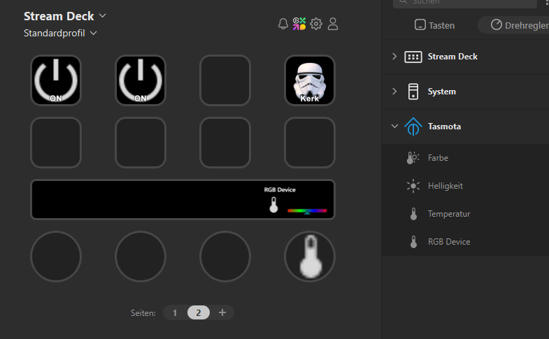
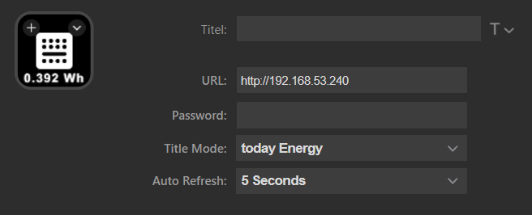
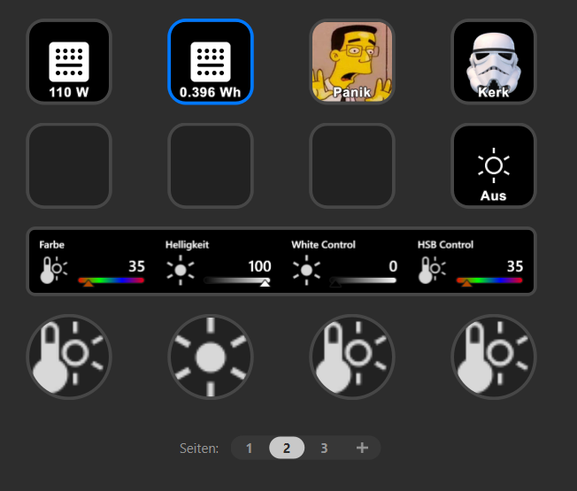
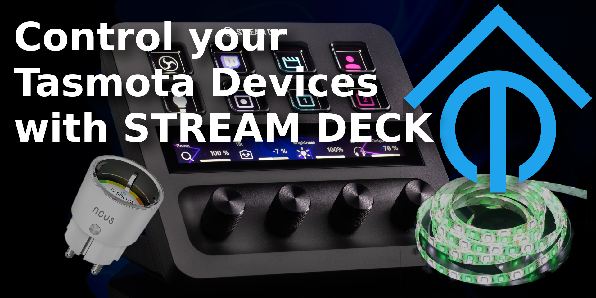
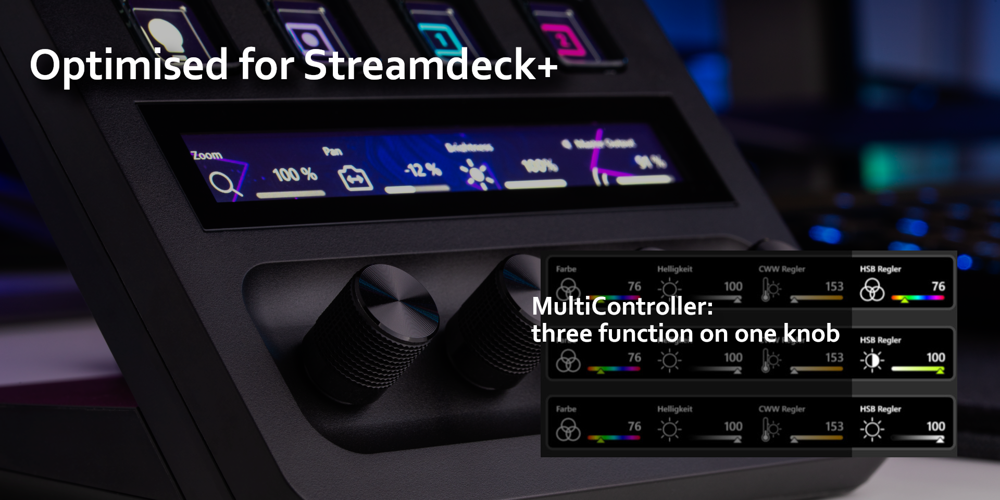

# Stream Deck Tasmota Plugin V2

Refactored for Stream Deck 7.0+ — optimized for SD+

## Description

`Stream Deck Tasmota Plugin` is a complete plugin that allows you to control Tasmota smart home devices directly from your Stream Deck.

- Control Tasmota LED strips (RGB, RGBWW, CWW)
- Control Tasmota outlets
- Display Tasmota power monitoring

## Features

- Complete and granular control of RGBWW LEDs
- Store and recall static color/temperature values
- State is read automatically on appearance
- Multiple controls for the same device are synchronized
- Auto-refresh polling of device state
- Immediate display update while rotating (no waiting for HTTP confirmation)
- View state of multi-parameter controls is preserved when switching pages
- Error feedback: all controls of a device flash red when the device is unreachable

## Tested with

- H801 RGBWW LED controller
- NOUS A1T Outlet with Power Meter

## Quick Start

1. Drag any action onto your Stream Deck key or dial
2. Enter the URL (e.g. `http://192.168.1.100`) and optional password of your Tasmota device
3. The current state is read automatically

## Usage

Multiple controls can share the same device — state updates are dispatched to all controls of that device.

- Use **AutoRefresh** if you control your devices from another location (Tasmota WebGUI, home automation software, etc.)
- You only need one AutoRefresh per device; the shortest interval across all controls of a device is used
- When a device is unreachable, all its controls flash red

---

# Actions

## Outlet / Power Button

| Interaction | Action |
|---|---|
| Press | Toggle power on/off |

**Title modes:** Power state, current power (W), today's energy (kWh), total energy (kWh)

---

## Button — Static RGB Value

| Interaction | Action |
|---|---|
| Press | Set stored color |
| Hold | Toggle power |

---

## Button — Static CWW Value

| Interaction | Action |
|---|---|
| Press | Set stored color temperature + brightness |
| Hold | Toggle power |

---

## Button — Custom Command

| Interaction | Action |
|---|---|
| Press | Send primary command |
| Hold | Send alternative command |

---

## Color Control (Dial)

Controls the hue of RGBWW LEDs.

| Interaction | Action |
|---|---|
| Rotate | Adjust hue (0–360°) |
| Press | Toggle hue between 0° and 180° |
| Hold | Toggle power |

---

## Brightness Control (Dial)

Controls the brightness of RGBWW LEDs.

| Interaction | Action |
|---|---|
| Rotate | Adjust brightness (0–100%) |
| Press | Toggle brightness between 0% and 100% |
| Hold | Toggle power |

---

## Saturation Control (Dial)

Controls the color saturation of RGBWW LEDs.

| Interaction | Action |
|---|---|
| Rotate | Adjust saturation (0–100%) |
| Press | Toggle saturation between 0% and 100% |
| Hold | Toggle power |

---

## HSB Multi-Control (Dial)

Controls hue, saturation, and brightness in one dial with switchable views.

| Interaction | Action |
|---|---|
| Rotate | Adjust the active parameter |
| Press | Switch view: Hue → Saturation → Brightness → … |
| Hold | Toggle power |
| Touch hold | Toggle power |

**Layouts:** Color (Hue), Saturation, Brightness

---

## CWW Multi-Control (Dial)

Controls color temperature and white brightness in one dial with switchable views.

| Interaction | Action |
|---|---|
| Rotate | Adjust the active parameter |
| Press | Switch view: Color Temperature → Brightness → … |
| Hold | Toggle power |
| Touch hold | Toggle power |

**Layouts:** Color Temperature (153–500 Mired), Brightness (0–100%)
